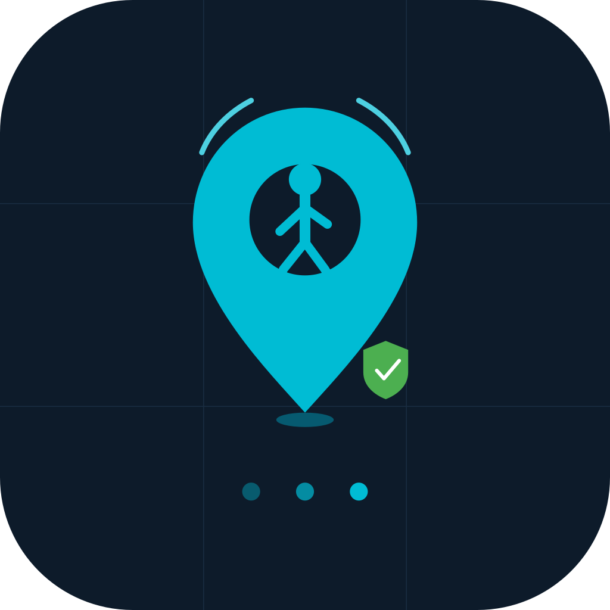
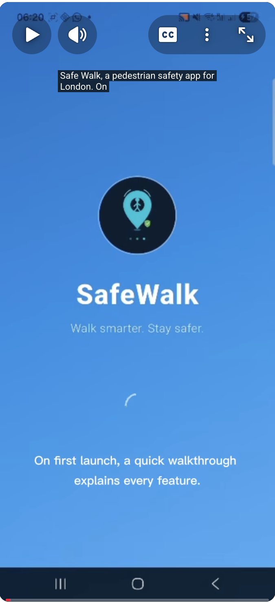

<p align="center">
  
</p>

# SafeWalk 🛡️

**A pedestrian safety companion for London, built with Flutter.**

SafeWalk helps people walk more confidently by scoring route safety in real time, alerting emergency contacts if they don't check in, and surfacing community-reported hazards — all from a single mobile app.

> Built as part of CASA0015: Mobile Systems and Interactions — UCL Connected Environments, 2025/26.

---


## 🎥 Demo

<a href="https://youtube.com/shorts/s6ArEvOEHMk">
  
</a>

> Click the image above to watch the full demo on YouTube.

---

## 🔍 What does SafeWalk do?

London has a pedestrian safety problem. UK crime statistics show that street-level violence and robbery are concentrated along specific corridors. Road collision data reveals persistent pedestrian danger points. Yet existing navigation apps like Google Maps route purely on speed — treating a dark unlit alley the same as a busy high street.

SafeWalk solves this by combining three independent data sources into a single **CombinedSafetyScore (0–100)** for every walking route:

| Data Layer | Source | What it captures |
|---|---|---|
| Street crime | UK Police API | Violent crime, robbery, antisocial behaviour per route segment |
| Road collisions | DfT STATS19 | Pedestrian-involved collisions, fatal and serious |
| Pedestrian infrastructure | OpenStreetMap / Overpass API | Lit paths, pavements, crossing types, surface quality |

The score is further **modulated by time of day** — a route that's safe at noon scores lower at midnight, reflecting real crime and incident patterns.

---

## 🧭 Why is SafeWalk useful?

- **Women walking alone at night** — the primary design persona. Real-time safety score + automatic SOS if something goes wrong.
- **Tourists and newcomers** — unfamiliar with which areas of London feel unsafe after dark.
- **Commuters** — choosing between a fast but poorly-lit route and a slightly longer but safer alternative.
- **Connected Environments research** — demonstrates how open public datasets (crime, collision, OSM) can be fused into real-time, location-aware citizen safety tools.

---

## ✨ Features

### Route Planning
- Search any origin and destination using Google Places autocomplete
- Fetch up to 3 walking route alternatives simultaneously
- Score each route using the CombinedSafetyScore pipeline
- Visualise routes on a map with colour-coded path segments (🟢 safe → 🔴 dangerous)
- Pick a route on the visual map picker before committing

### Safety Scoring
- **Crime score** — Police API queried for crimes within 200m of each route point, weighted by category severity and time of day
- **Collision score** — DfT STATS19 data, fatal collisions weighted 3× vs serious
- **Infrastructure score** — OSM tags: `lit=yes`, `sidewalk=both`, `surface=asphalt`, crossing types
- **Time multiplier** — 1.0× (daytime) → 2.5× (late night) applied to crime component
- Final score: weighted blend, 0 = most dangerous, 100 = safest

### During the Walk
- GPS tracking with heading-up compass mode (30° tilt)
- Progress bar: walked vs remaining distance and time
- Elapsed timer + estimated arrival
- Community report markers visible on route

### Arrival Check-in
- Countdown timer starts when trip begins (estimated time + 5 min buffer)
- Banner shows countdown: blue → orange (2 min) → red + pulsing (1 min)
- If user doesn't tap "I'm Safe": full-screen alert dialog fires + SMS sent to emergency contact with GPS coordinates

### SOS Button
- Single tap → calls 999 immediately
- Long press → sends SMS to saved emergency contact with live location link
- Emergency contact configured in settings with contact picker

### Community Reporting (Crowdsourcing)
- 7 hazard categories: poor lighting, obstruction, antisocial behaviour, road hazard, suspicious activity, unsafe path, other
- Reports visible to all users in real time — Volunteered Geographic Information (VGI)
- Optional description field
- Reports stored in Firebase Firestore, displayed as cyan markers on map
- Reports persist across sessions and users

### Saved Destinations
- Save up to 5 frequent places with custom emoji icon and label
- Tap to instantly populate destination field
- Long press to edit or delete
- Persisted locally with SharedPreferences

### Onboarding
- 5-screen animated walkthrough on first launch only
- Covers: what SafeWalk does, how to read the route, arrival check-in, SOS, community features
- Skippable; never shown again after first completion

---

## 🏗️ Architecture

```
lib/
├── main.dart                         # Entry point, Firebase init
├── pages/
│   ├── splash_page.dart              # Animated splash, routes to onboarding or home
│   ├── onboarding_page.dart          # 5-screen first-launch walkthrough
│   ├── home_page.dart                # Route planning, saved destinations, time picker
│   ├── route_picker_page.dart        # Visual map-based route selection
│   └── route_page.dart              # Active walk: map, panel, check-in, SOS
├── services/
│   ├── combined_safety_score.dart    # Core scoring engine — fuses all data sources
│   ├── police_service.dart           # UK Police API — street crime along route
│   ├── road_safety_service.dart      # DfT STATS19 — pedestrian collisions
│   ├── osm_service.dart              # Overpass API — pedestrian infrastructure
│   ├── route_service.dart            # Google Directions API — route fetching
│   ├── location_service.dart         # GPS + reverse geocoding
│   ├── sos_service.dart              # Emergency call + SMS
│   ├── report_service.dart           # Firebase Firestore — community reports
│   ├── arrival_checkin_service.dart  # Countdown timer + auto-alert
│   └── saved_destinations_service.dart # Local storage for saved places
└── widgets/
    ├── safety_badge.dart             # Score pill with colour and label
    ├── sos_button.dart               # Floating SOS action button
    ├── report_button.dart            # Floating report action button
    ├── checkin_banner.dart           # Countdown banner during walk
    └── permission_wrapper.dart       # Location permission gate
```

---

## 🔌 APIs and Services

| Service | Purpose | Auth |
|---|---|---|
| [Google Maps SDK](https://developers.google.com/maps/documentation/android-sdk) | Map display, markers, polylines | API key (restricted) |
| [Google Directions API](https://developers.google.com/maps/documentation/directions) | Walking route alternatives | API key (unrestricted) |
| [Google Places API](https://developers.google.com/maps/documentation/places) | Address autocomplete | API key |
| [UK Police API](https://data.police.uk/docs/) | Street crime data — free, no key required | None |
| [DfT STATS19](https://data.dft.gov.uk/road-accidents-safety-data/) | Road collision data — pre-loaded JSON | None |
| [Overpass API / OSM](https://wiki.openstreetmap.org/wiki/Overpass_API) | Pedestrian infrastructure tags | None |
| [Firebase Firestore](https://firebase.google.com/docs/firestore) | Community reports storage and retrieval | Firebase project |

---

## 📊 Data Flow

```
User sets destination
        ↓
Google Directions API → up to 3 route alternatives
        ↓
For each route (parallel):
  ├── Police API   → crime points within 200m of route
  ├── DfT STATS19  → collision points within 150m of route
  └── Overpass API → infrastructure tags for each segment
        ↓
CombinedSafetyScore → weighted blend × time multiplier
        ↓
Route Picker → user selects preferred route visually
        ↓
RoutePage → active walk with check-in countdown
        ↓
Firebase → community reports overlaid on map
```

---

## 🚶 User Journey

1. **First launch** — animated splash → 5-screen onboarding explaining the app
2. **Plan a walk** — search destination, browse saved places, set walking time
3. **Compare routes** — see 3 alternatives scored and colour-coded on the map
4. **Start walk** — panel collapses, heading-up navigation begins, check-in countdown starts
5. **Walk** — see progress, community hazard markers, SOS button always visible
6. **Arrive** — tap "I'm Safe" → countdown cancelled, walk ends
7. **Missed check-in** — red warning dialog fires + SMS sent to emergency contact

---

## 🛠️ Getting Started

### Prerequisites
- Flutter SDK ≥ 3.x
- Android SDK (API 24+)
- Firebase project with Firestore enabled
- Google Cloud project with Maps SDK, Directions, and Places APIs enabled

### Setup

1. **Clone the repository**
```bash
git clone https://github.com/gilangpamungkas/Safewalk.git
cd Safewalk
```

2. **Create `.env` file** in the project root:
```
MAPS_API_KEY=your_unrestricted_key_here
MAPS_DISPLAY_KEY=your_android_restricted_key_here
```

3. **Add `google-services.json`** to `android/app/` from your Firebase project console

4. **Install dependencies**
```bash
flutter pub get
```

5. **Run on a connected Android device**
```bash
flutter run
```

### API Key Setup
- Create two API keys in Google Cloud Console
- `MAPS_DISPLAY_KEY` — restrict to Android app, enable Maps SDK only
- `MAPS_API_KEY` — unrestricted (or IP-restricted), enable Directions + Places

---

## 🧪 Testing

### Manual test checklist
- [ ] Route scoring returns non-zero crime/collision counts for central London routes
- [ ] Check-in countdown fires warning dialog after timer expires (test with 1 min timer)
- [ ] SOS long-press opens SMS app with emergency contact pre-filled
- [ ] Community report saves to Firestore and appears as cyan marker on reload
- [ ] Saved destinations persist across app restarts
- [ ] Onboarding only shows on first launch

### User testing
Conducted with 3 UCL students walking routes in Bloomsbury and Kings Cross at different times of day. Key findings:
- Safety scores felt intuitive and matched participants' prior perceptions of route safety
- Arrival check-in feature rated as "genuinely useful" by all participants
- Requested: widget to quickly see score without opening app

---

## 🔮 Future improvements

- **Background check-in** — move timer to a background service so SMS fires even if app is minimised
- **Twilio SMS** — replace `url_launcher` SMS with server-side sending for truly automatic alerts
- **iOS support** — currently Android only; iOS build requires Apple Developer account
- **Comfort scoring** — integrate Mapillary imagery + semantic segmentation to score pavement quality, shade, and crowding
- **Historical patterns** — show how a route's safety score changes across hours of the day
- **Offline mode** — cache route and score data for frequently walked routes
- **Widget** — home screen widget showing current area safety level

---

## 📁 Repository structure

```
Safewalk/
├── lib/              # All Flutter/Dart source code
├── assets/
│   ├── icon/         # App icon (PNG + SVG)
│   └── london_collisions.json  # Pre-loaded DfT collision data
├── android/          # Android-specific configuration
├── docs/
│   ├── screenshots/  # App screenshots for README
│   ├── wireframes/   # UX wireframes and storyboards
│   └── demo.mp4      # Demo video
└── README.md
```

---

## 👤 Author

**Gilang Pamungkas**
MSc Connected Environments, UCL Bartlett Centre for Advanced Spatial Analysis (CASA)
[github.com/gilangpamungkas](https://github.com/gilangpamungkas)

---

## 📄 Licence

MIT — see [LICENSE](LICENSE)

---

## 🙏 Acknowledgements

- [UK Police Data](https://data.police.uk) — open crime data
- [Department for Transport](https://www.data.gov.uk/dataset/cb7ae6f0-4be6-4935-9277-47e5ce24a11f/road-safety-data) — STATS19 collision data
- [OpenStreetMap contributors](https://www.openstreetmap.org) — pedestrian infrastructure data
- [Firebase](https://firebase.google.com) — community reports backend
- UCL CASA — module guidance and feedback